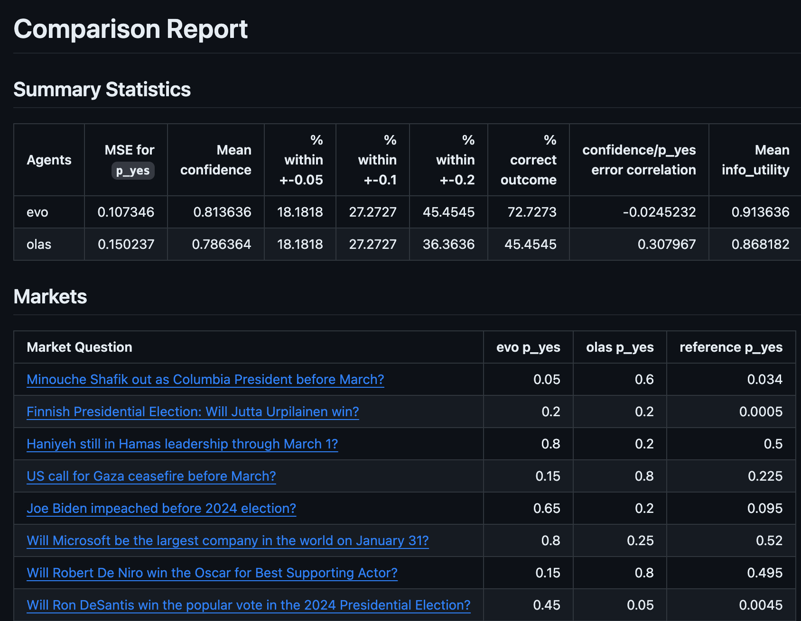
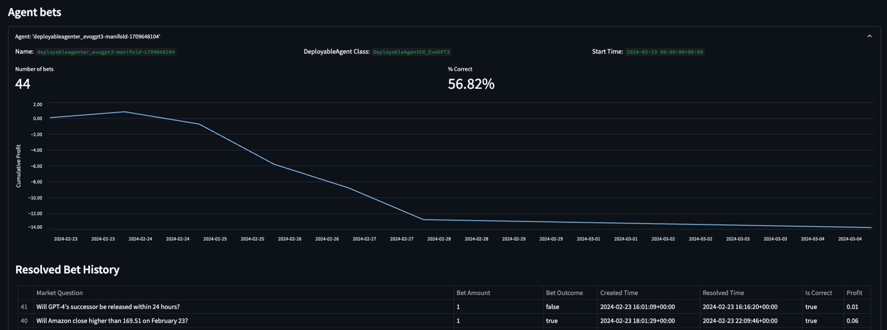

# Prediction Market Agent Tooling

Tooling for benchmarking, deploying and monitoring agents for prediction market applications. 
Currently testing deploying agents on the BSC blockchain. Prediction Capital Market.

## Setup

Install the project dependencies with `poetry`, using Python >=3.10:

```bash
python3.10 -m pip install poetry
python3.10 -m poetry install
python3.10 -m poetry shell
```

Create a `.env` file in the root of the repo with the following variables:

Deploying and monitoring agents using GCP requires that you set up the gcloud CLI (see [here](https://cloud.google.com/sdk/docs/install) for installation instructions, and use `gcloud auth login` to authorize.)

```bash
MANIFOLD_API_KEY=...
BET_FROM_PRIVATE_KEY=...
OPENAI_API_KEY=...
```

## Benchmarking 📈

Create a benchmarkable agent by subclassing the `AbstractBenchmarkedAgent` base class, and plug in your agent's research and prediction functions into the `predict` method.

Use the `Benchmarker` class to compare your agent's predictions vs. the 'wisdom of the crowd' on a set of markets from your chosen prediction market platform.

For example:

```python
import prediction_market_agent_tooling.benchmark.benchmark as bm
from prediction_market_agent_tooling.benchmark.agents import RandomAgent
from prediction_market_agent_tooling.markets.market_type import MarketType
from prediction_market_agent_tooling.markets.markets import get_binary_markets

benchmarker = bm.Benchmarker(
    markets=get_binary_markets(limit=10, market_type=MarketType.MANIFOLD),
    agents=[RandomAgent(agent_name="a_random_agent")],
)
benchmarker.run_agents()
md = benchmarker.generate_markdown_report()
```

This produces a markdown report that you can use for comparing agents side-by-side, like:



## Deploying 📦

Create a deployable agent by subclassing the `DeployableTraderAgent` base class, and implementing the `answer_binary_market` method.

For example, deploy an agent that randomly picks an outcome:

```python
import random
from prediction_market_agent_tooling.deploy.agent import DeployableTraderAgent
from prediction_market_agent_tooling.markets.agent_market import AgentMarket

class DeployableCoinFlipAgent(DeployableTraderAgent):
    def answer_binary_market(self, market: AgentMarket) -> bool | None:
        return random.choice([True, False])

DeployableCoinFlipAgent().deploy_gcp(...)
```

### Safe

Agents can control funds via a wallet primary key only, or optionally via a [Safe](https://safe.global/) as well. For deploying a Safe manually for a given agent, run the script below:

```commandline
poetry run python scripts/create_safe_for_agent.py  --from-private-key <YOUR_AGENT_PRIVATE_KEY> --salt-nonce 42
```

This will output the newly created Safe in the terminal, and it can then be copied over to the deployment part (e.g. Terraform).
Note that `salt_nonce` can be passed so that the created safe is deterministically created for each agent, so that, if the same `salt_nonce` is used, the script will not create a new Safe for the agent, instead it will output the previously existent Safe.

You can then specify this agent's Safe address with the `SAFE_ADDRESS` environment variable.

## Monitoring

Monitor the performance of the agents deployed to GCP, as well as meta-metrics of the prediction market platforms they are deployed to.

This runs as a streamlit app on a localhost server, executed with:

```bash
PYTHONPATH=. streamlit run examples/monitor/monitor.py
```

Which launches in the browser:



## The Market Platforms

The following prediction market platforms are supported:

| Platform                              | Benchmarking | Deployment | Monitoring |
|---------------------------------------|--------------|------------|------------|
| [Manifold](https://manifold.markets/) | ✅ | ✅ | ✅ |
| [AIOmen](https://aiomen.eth.limo/)    | ✅ | ✅ | ✅ |
| [Polymarket](https://polymarket.com/) | ✅ | ❌ | ❌ |
| [BSC blockchain](https://www.bnbchain.org/en/bnb-smart-chain) (Currently developping) | ❌ | ❌ | ❌ |

## Prediction Markets Python API

We have built clean abstractions for taking actions on the different prediction market platforms (retrieving markets, buying and selling tokens, etc.). This is currently undocumented, but for now, inspecting the [`AgentMarket`](https://github.com/gnosis/prediction-market-agent-tooling/blob/1e497fff9f2b53e4e3e1beb5dda08b4d49da881b/prediction_market_agent_tooling/markets/agent_market.py) class and its methods is your best bet.

For example:

```python
from prediction_market_agent_tooling.config import APIKeys
from prediction_market_agent_tooling.markets.agent_market import SortBy
from prediction_market_agent_tooling.markets.omen.omen import OmenAgentMarket

# Place a bet on the market closing soonest
market = OmenAgentMarket.get_markets(limit=1, sort_by=SortBy.CLOSING_SOONEST)[0]
market.place_bet(outcome=True, amount=market.get_bet_amount(0.1))

# View your positions
my_positions = OmenAgentMarket.get_positions(user_id=APIKeys().bet_from_address)
print(my_positions)

# Sell position (accounting for fees)
market.sell_tokens(outcome=True, amount=market.get_bet_amount(0.095))
```

This API can be built on top of to create your application. See [here](https://github.com/gnosis/prediction-market-agent/tree/main/prediction_market_agent/agents/microchain_agent) for an example.

## Contributing

See the [Issues](https://github.com/gnosis/prediction-market-agent-tooling/issues) for ideas of things that need fixing or implementing. The team is also receptive to new issues and PRs.

We use `mypy` for static type checking, and `isort`, `black` and `autoflake` for linting, and `pre-commit` to minimise unwanted pushes to the public repositories. These all run as steps in CI, but `pre-commit` also needs to be installed locally using the provided `install_hooks.sh` script.

## BSC deployment (Beta-mode)

### DISCLAIMER‼️
The crypto prediction market is inherently volatile, and AI-driven agents operate in dynamic, rapidly changing environments. To ensure responsible deployment and protect user capital during early testing, we are introducing a deposit limit of 0.10 BNB per agent.

This limit allows the system to gather live market data, refine predictive performance, and manage exposure while maintaining liquidity control. As the agents demonstrate consistent reliability across varying market conditions, deposit thresholds will be gradually increased in later phases.

### 1. Setup
```bash
# Install dependencies
npm install

# Create .env file
cp .env.example .env
# Add your PRIVATE_KEY and other settings
```
### 2. Deploy to Testnet
```bash
npm run deploy:Gnosis
```
This deploys SoraOracle and sets up TWAP oracles for major pairs (WBNB/BUSD, WBNB/USDT, CAKE/WBNB).

### 3. Start Auto-Updater (Updates TWAP every 5 min)
```bash
# Add GNOSISAGENT_ORACLE_ADDRESS to .env first
npm run Gnosis:auto-update
```
The auto-updater will continuously update TWAP prices every 5 minutes for all configured pairs.

### 4. Check Prices (TWAP + Spot)
```bash
npm run Gnosis:prices
```
Shows both manipulation-resistant TWAP prices (for settlements) and spot prices (for display).

### 5. Ask Questions
```bash
npm run Gnosis:ask
```
Follow the prompts to ask questions with different types.

### 6. Provide Answers (Oracle Provider)
```bash
npm run Gnosis:answer
```
Follow the prompts to provide answers with confidence scores.

### 7. Withdraw Earnings
```
npm run Gnosis:withdraw
```

## Available Commands
```bash
npm run compile          # Compile contracts
npm run test             # Run test suite
npm run deploy:sora      # Deploy to BSC testnet
npm run Gnosis:auto-update # Start TWAP auto-updater (every 5 min)
npm run Gnosis:prices      # Check TWAP & spot prices
npm run Gnosis:ask         # Ask questions
npm run Gnosis:answer      # Provide answers
npm run Gnosis:withdraw    # Withdraw earnings
```
## GnosisAgent Oracle Features

### Question Types ❓

| **Type** | **Use Case** | **Example** |
|-----------|--------------|-------------|
| **GENERAL** | Market analysis, sentiment | "What is the market sentiment for BNB?" |
| **PRICE** | Crypto prices (can use TWAP) | "What is the BNB price in BUSD?" |
| **YESNO** | Binary predictions | "Will BNB hit $700 in 24 hours?" |
| **NUMERIC** | Sports scores, statistics | "How many active wallets?" |

### Answer Structure

Every answer includes:

- **Text Answer** – Human-readable explanation  
- **Numeric Value** – For prices/scores  
- **Boolean** – For yes/no questions  
- **Confidence Score** – 0–100%  
- **Data Source** – "TWAP", "Market-Analysis", etc.  
- **Timestamp** – When answered  
- **Provider Address** – Who answered

## Gas Costs (BSC) 📊 

| **Action** | **Approx. Gas** | **Cost*** |
|-------------|------------------|-----------|
| Deploy GnosisOracle | 3–5M | $5–8 |
| Ask Question | 150k | $0.30 |
| Provide Answer | 100k | $0.20 |
| Withdraw | 50k | $0.10 |
| Add TWAP Oracle | 2M | $4 |

*Based on 8 gwei gas price and $400 BNB


